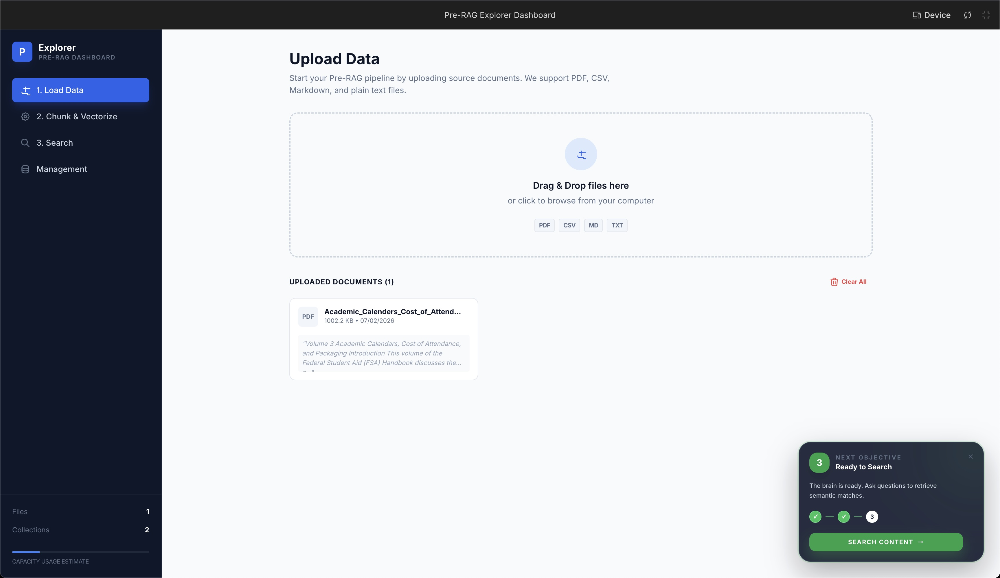
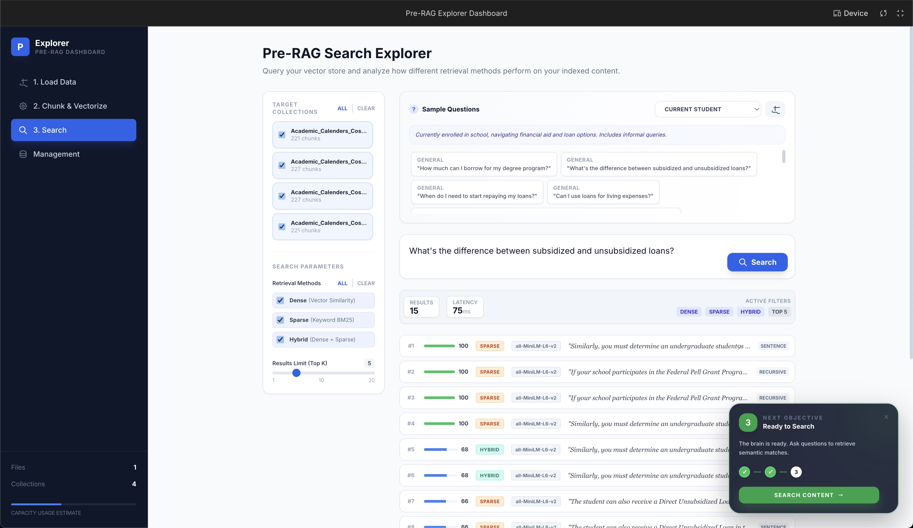
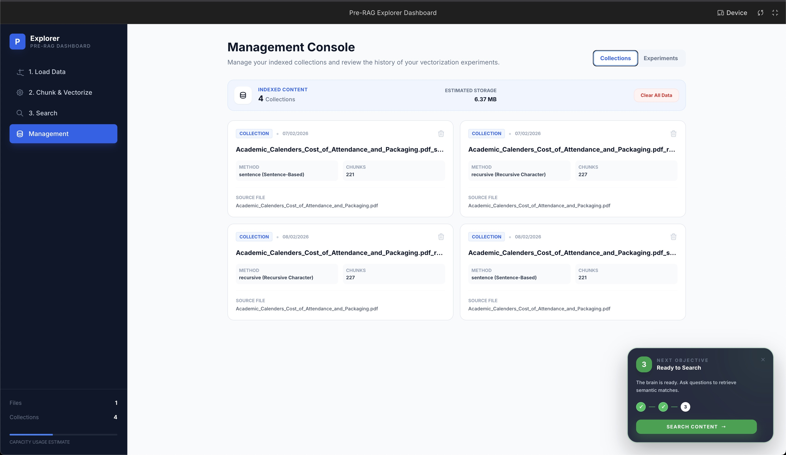

<div align="center">

</div>

# Pre-RAG Explorer Dashboard


A comprehensive Pre-RAG prototype dashboard for document parsing, multi-method chunking, vector embedding generation, and hybrid search exploration. Built with React and powered by in-browser ML models.

---

## Screenshots

<!-- TODO: Replace placeholders with actual screenshots saved in docs/images/ -->

| Upload Documents | Process & Chunk |
|:---:|:---:|
|  |  |
| *Drag-and-drop file upload with multi-format support* | *5 chunking strategies with configurable parameters* |

| Search & Explore | Collections Manager |
|:---:|:---:|
|  |  |
| *Hybrid search with dense, sparse & combined retrieval* | *Manage vector collections and experiment history* |

---

## Quick Start

**Prerequisites:** Node.js (v18+)

```bash
# Install dependencies
npm install

# Run the app
npm run dev
```

The app will be available at `http://localhost:5173`

---

## Key Features

- **5 Chunking Strategies**
  - Fixed-size chunking
  - Recursive character splitting
  - Token-based chunking
  - Sentence-based chunking
  - Semantic grouping

- **3 Retrieval Methods**
  - Dense retrieval (cosine similarity)
  - Sparse retrieval (BM25)
  - Hybrid search (combined scoring)

- **In-Browser ML Processing**
  - Runs Xenova/all-MiniLM-L6-v2 model entirely in browser
  - No server-side processing required
  - 384-dimensional embeddings

- **Multiple File Formats**
  - Plain text (.txt)
  - CSV files
  - PDF documents
  - Markdown (.md)

- **Experiment Tracking**
  - Compare chunking strategies
  - Track processing times
  - Analyze chunk distributions
  - Persistent experiment history

- **Browser-Based Storage**
  - IndexedDB for vector collections
  - localStorage for experiments
  - No external database required

---

## Technical Components

### Frontend (React + TypeScript)
- **UI Framework**: React 19.2.4 with TypeScript 5.8.2
- **Build Tool**: Vite 6.2.0 for fast development
- **State Management**: React hooks with local state
- **Styling**: Tailwind-like utility classes

### ML & Embeddings
- **Model**: Xenova/all-MiniLM-L6-v2 (BERT-based, quantized)
- **Library**: @xenova/transformers 2.16.0
- **Dimensions**: 384
- **Execution**: Client-side, in-browser processing

### Services Architecture
```
services/
├── fileParser.ts        # Handles text, CSV, PDF, markdown parsing
├── chunkingService.ts   # Implements 5 chunking strategies
├── embeddingService.ts  # Generates embeddings using Transformers.js
└── vectorStore.ts       # IndexedDB operations for collections
```

### Component Structure
```
components/
├── layout/
│   ├── Sidebar.tsx           # Navigation with 4 views
│   ├── GuidanceBalloon.tsx   # Contextual help
│   └── ErrorDisplay.tsx      # Error handling UI
├── upload/
│   └── FileUpload.tsx        # File upload interface
├── chunking/
│   └── ProcessSection.tsx    # Chunking configuration & processing
├── search/
│   └── SearchSection.tsx     # Search interface & results
├── collections/
│   └── CollectionsManager.tsx # Vector collection management
└── common/
    └── CopyButton.tsx        # Reusable copy-to-clipboard
```

---

## Usage Workflow

> **100% Browser-Based**: The entire workflow below runs entirely in your browser. The ML embedding model is downloaded and cached locally on first load, all document parsing, chunking, embedding generation, and search happens client-side, and all data is stored in browser storage (IndexedDB and localStorage). No data ever leaves your machine. Stored items can be individually or bulk deleted via the Collections Manager.

1. **Upload Documents**
   - Drag and drop or select files (text, CSV, PDF, markdown)
   - Files are parsed and stored in browser

2. **Process & Chunk**
   - Select one or more chunking methods
   - Configure parameters (chunk size, overlap, etc.)
   - Generate embeddings using in-browser ML model
   - Track processing status in real-time

3. **Search & Explore**
   - Enter natural language queries
   - Choose retrieval method (dense, sparse, hybrid)
   - View ranked results with similarity scores
   - Compare results across different chunking strategies

4. **Manage Collections**
   - View all vector collections
   - Delete unused collections
   - Export experiment data
   - Clear all data if needed

---

## Chunking Methods Explained

| Method | Description | Best For |
|--------|-------------|----------|
| **Fixed** | Splits text into equal-sized chunks with optional overlap | General-purpose, consistent chunk sizes |
| **Recursive** | Recursively splits on characters (paragraphs → sentences → words) | Preserving document structure |
| **Token** | Splits based on token count (word boundaries) | Language model compatibility |
| **Sentence** | Groups by sentence count | Maintaining semantic completeness |
| **Semantic** | Groups semantically similar sentences together | Preserving topic coherence |

---

## Retrieval Methods Explained

| Method | Algorithm | Strengths |
|--------|-----------|-----------|
| **Dense** | Cosine similarity on embeddings | Semantic understanding, handles paraphrasing |
| **Sparse** | BM25 (term frequency) | Keyword matching, exact term retrieval |
| **Hybrid** | Combined dense + sparse scoring | Best of both worlds, balanced results |

---

## Browser Compatibility

- **Chrome/Edge**: Full support (recommended)
- **Firefox**: Full support
- **Safari**: Full support (v15+)
- **Mobile**: Limited (large model downloads)

**Note**: First load downloads the ~23MB ML model. Subsequent loads use browser cache.

---

## Development

```bash
# Install dependencies
npm install

# Start development server (with hot reload)
npm run dev

# Build for production
npm run build

# Preview production build
npm preview
```

---

## Environment Variables

Create a `.env.local` file in the project root:

```bash
GEMINI_API_KEY=your_api_key_here
```

> **Note**: The app primarily uses in-browser embeddings (Xenova/all-MiniLM-L6-v2) and does not require an API key for core functionality.

---

## Built With

**AI/ML Stack**
- 
- 

**Frontend Stack**
- 
- 
- 

**Data Processing**
-  (CSV parsing)
- IndexedDB (vector storage)

---

## Troubleshooting

### Model Loading Issues
```bash
# Clear browser cache and reload
# Check browser console for errors
# Ensure stable internet connection for first load
```

### Storage Quota Exceeded
```bash
# Clear collections in Collections Manager
# Or manually clear IndexedDB in browser DevTools
```

### Performance Issues
```bash
# Reduce chunk size for faster processing
# Process fewer methods simultaneously
# Close other browser tabs to free memory
```

---

## Contributing

Contributions are welcome! Please feel free to submit a Pull Request.

---

## License

MIT
