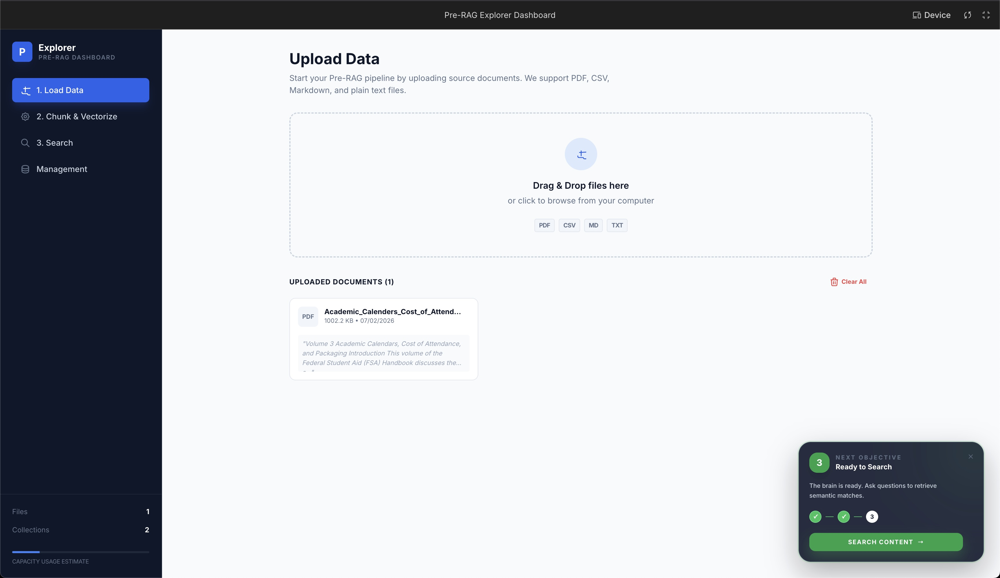
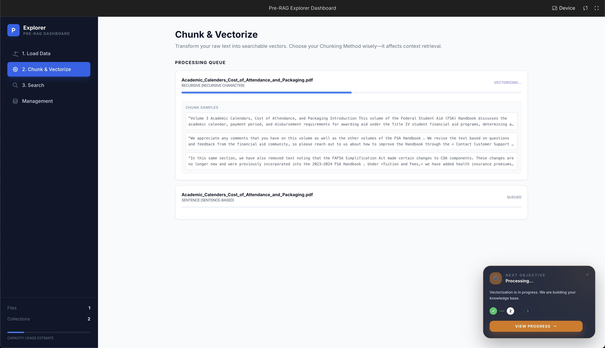
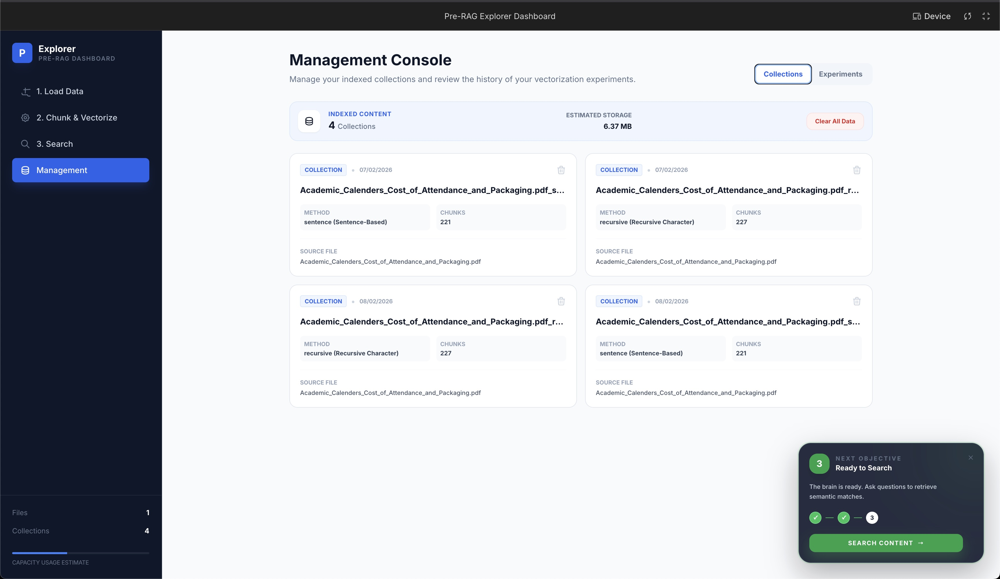

# Pre-RAG Explorer Dashboard


A comprehensive Pre-RAG prototype dashboard for document parsing, multi-method chunking, vector embedding generation, and hybrid search exploration. Built with React and powered by in-browser ML models.

---

## Screenshots

| Upload Documents | Process & Chunk |
|:---:|:---:|
|  |  |
| *Drag-and-drop file upload with multi-format support* | *5 chunking strategies with configurable parameters* |

| Search Interface | Search Results |
|:---:|:---:|
|  |  |
| *Natural language query with retrieval method selection* | *Ranked results with similarity scores* |

| Collections Manager |
|:---:|
|  |
| *Manage vector collections and experiment history* |

---

## Quick Start

**Prerequisites:** Node.js 20+ (see `.nvmrc`)

```bash
# Install dependencies (React 19 peer-dep compatibility)
npm install --legacy-peer-deps

# Run the app
npm run dev
```

The app will be available at `http://localhost:3000`

---

## Key Features

- **6 Chunking Strategies**
  - Fixed-size chunking
  - Recursive character splitting
  - Token-based chunking
  - Sentence-based chunking
  - Semantic grouping
  - Sliding window (stride-based overlap)

- **3 Retrieval Methods**
  - Dense retrieval (cosine similarity)
  - Sparse retrieval (BM25)
  - Hybrid search (combined scoring)

- **Multi-Model Embedding Registry**
  - Select from registered models in Process view (dropdown + metadata tooltips)
  - **all-MiniLM-L6-v2** (~23MB) — fast general-purpose embeddings
  - **BGE Small EN v1.5** (~33MB) — optimized for retrieval tasks
  - Both produce 384-dimensional vectors; collections are tagged by model

- **In-Browser ML Processing**
  - Transformers.js runs entirely in the browser (no server-side processing)
  - Models lazy-load on first use and cache in browser storage
  - No data leaves your machine

- **Multiple File Formats**
  - Plain text (.txt)
  - CSV files
  - PDF documents
  - Markdown (.md)

- **Experiment Tracking**
  - Compare chunking strategies
  - Track processing times
  - Analyze chunk distributions
  - Persistent experiment history

- **Browser-Based Storage**
  - IndexedDB for vector collections
  - localStorage for experiments
  - No external database required

---

## Technical Components

### Frontend (React + TypeScript)
- **UI Framework**: React 19.2.4 with TypeScript 5.8.2
- **Build Tool**: Vite 6.2.0 for fast development
- **State Management**: React hooks with local state
- **Styling**: Tailwind-like utility classes

### ML & Embeddings
- **Registry**: `constants/modelRegistry.ts` — centralized model metadata and defaults
- **Validation**: `utils/modelValidation.ts` — type-safe model ID checks
- **Models**: Xenova/all-MiniLM-L6-v2 (default), Xenova/bge-small-en-v1.5
- **Library**: @xenova/transformers 2.17.2
- **Dimensions**: 384 (both current models)
- **Execution**: Client-side, in-browser processing with model switching

### Services Architecture
```
constants/
└── modelRegistry.ts     # MODEL_REGISTRY, ModelConfig, DEFAULT_MODEL_ID

utils/
└── modelValidation.ts   # validateModelConfig, getModelById, isValidModelId, etc.

services/
├── fileParser.ts        # Handles text, CSV, PDF, markdown parsing
├── chunkingService.ts   # Implements 5 chunking strategies
├── embeddingService.ts  # Embeddings via Transformers.js (modelId-aware)
└── vectorStore.ts       # IndexedDB operations for collections
```

### Component Structure
```
components/
├── layout/
│   ├── Sidebar.tsx           # Navigation with 4 views
│   ├── GuidanceBalloon.tsx   # Contextual help
│   └── ErrorDisplay.tsx      # Error handling UI
├── upload/
│   └── FileUpload.tsx        # File upload interface
├── chunking/
│   └── ProcessSection.tsx    # Chunking configuration & processing
├── search/
│   └── SearchSection.tsx     # Search interface & results
├── collections/
│   └── CollectionsManager.tsx # Vector collection management
└── common/
    └── CopyButton.tsx        # Reusable copy-to-clipboard
```

---

## Usage Workflow

> **100% Browser-Based**: The entire workflow below runs entirely in your browser. The ML embedding model is downloaded and cached locally on first load, all document parsing, chunking, embedding generation, and search happens client-side, and all data is stored in browser storage (IndexedDB and localStorage). No data ever leaves your machine. Stored items can be individually or bulk deleted via the Collections Manager.

1. **Upload Documents**
   - Drag and drop or select files (text, CSV, PDF, markdown)
   - Files are parsed and stored in browser

2. **Process & Chunk**
   - Select an embedding model from the registry dropdown
   - Select one or more chunking methods (parameter tooltips explain each field)
   - Configure parameters (chunk size, overlap, etc.)
   - Generate embeddings using the selected in-browser model
   - Track processing status in real-time

3. **Search & Explore**
   - Enter natural language queries
   - Choose retrieval method (dense, sparse, hybrid)
   - Search across collections grouped by embedding model
   - View ranked results with similarity scores
   - Compare results across chunking strategies and models

4. **Manage Collections**
   - View all vector collections
   - Delete unused collections
   - Export experiment data
   - Clear all data if needed

---

## Chunking Methods Explained

| Method | Description | Best For |
|--------|-------------|----------|
| **Fixed** | Splits text into equal-sized chunks with optional overlap | General-purpose, consistent chunk sizes |
| **Recursive** | Recursively splits on characters (paragraphs → sentences → words) | Preserving document structure |
| **Token** | Splits based on token count (word boundaries) | Language model compatibility |
| **Sentence** | Groups by sentence count | Maintaining semantic completeness |
| **Semantic** | Groups semantically similar sentences together | Preserving topic coherence |

---

## Retrieval Methods Explained

| Method | Algorithm | Strengths |
|--------|-----------|-----------|
| **Dense** | Cosine similarity on embeddings | Semantic understanding, handles paraphrasing |
| **Sparse** | BM25 (term frequency) | Keyword matching, exact term retrieval |
| **Hybrid** | Combined dense + sparse scoring | Best of both worlds, balanced results |

---

## Browser Compatibility

- **Chrome/Edge**: Full support (recommended)
- **Firefox**: Full support
- **Safari**: Full support (v15+)
- **Mobile**: Limited (large model downloads)

**Note**: First use of each model downloads it (~23MB for MiniLM, ~33MB for BGE). Subsequent loads use browser cache.

---

## Development

```bash
# Install dependencies (React 19 peer-dep compatibility)
npm install --legacy-peer-deps

# Start development server (with hot reload)
npm run dev

# Build for production
npm run build

# Preview production build
npm run preview

# Quality gates (run before committing — mirrors CI)
./scripts/quality-gates.sh   # full: lint, format, typecheck, test, coverage, audit, build
npm run test:all             # quick subset: lint + format + typecheck + test
npm run verify               # typecheck + build
npm run lint                 # ESLint strict mode (0 warnings)
npm run format:check         # Prettier
npm run typecheck            # TypeScript
npm run test                 # Vitest (75 tests)
npm run test:coverage        # Coverage report (40% threshold, ~72% actual)
npm audit --audit-level=high
```

---

## Environment Variables

Copy the example file and edit as needed:

```bash
cp .env.example .env.local
```

Or create `.env.local` manually:

```bash
GEMINI_API_KEY=your_api_key_here
```

> **Note**: Core functionality uses in-browser embeddings from the model registry and does not require an API key. `GEMINI_API_KEY` is optional for future Gemini integration.

---

## Built With

**AI/ML Stack**
- 
- 

**Frontend Stack**
- 
- 
- 

**Data Processing**
-  (CSV parsing)
- IndexedDB (vector storage)

---

## Troubleshooting

### Model Loading Issues
```bash
# Clear browser cache and reload
# Check browser console for errors
# Ensure stable internet connection for first load
```

### Storage Quota Exceeded
```bash
# Clear collections in Collections Manager
# Or manually clear IndexedDB in browser DevTools
```

### Performance Issues
```bash
# Reduce chunk size for faster processing
# Process fewer methods simultaneously
# Close other browser tabs to free memory
```

---

## Contributing

See [docs/contributor-guide/development.md](docs/contributor-guide/development.md) for setup, quality gates, and slice workflow.

Before opening a PR, run `./scripts/quality-gates.sh` (matches CI exactly).

---

## License

MIT

<div align="center">

</div>